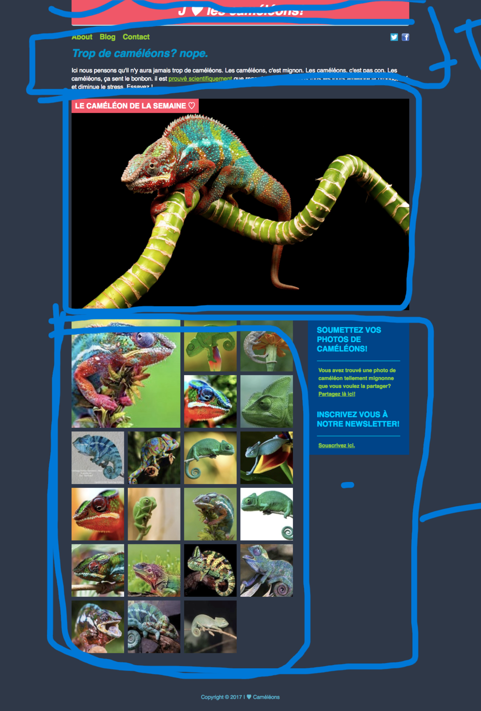

# Challenge Caméléons

## Instructions

Voici le résultet à réaliser (MVP):

Le plus important, l'organisation !

Le repo de base contient uniquement les images : c'est à vous de créer l'arborescence de fichiers et dossiers ! 🤓

Pour les petites coeurs, vous pouvez utiliser les caractères spéciaux représentant un coeur. Le site https://unicode-table.com/fr/ est top pour trouver les caractères spéciaux qu'on souhaite utiliser. Il donne même le code HTML. Mais, par contre, il ne fait pas le café.

Utilisez la méthode que vous préférez : [Grid layout](https://developer.mozilla.org/fr/docs/Web/CSS/grid) ou [Flexbox](https://developer.mozilla.org/fr/docs/Learn/CSS/CSS_layout/Flexbox). Enfin, voici un site où vous trouverez beaucoup de réponses à vos questions : [ici](https://css-tricks.com/guides/)

## Charte

* Largeur de la page (sans les marges) : `900px`
* Police : `Open Sans`, à aller chercher sur Google Fonts
* les codes couleur dont vous pourriez avoir besoin :
  + rose saumon = `#f05768`
  + bleu/gris foncé = `#2f3848`
  + bleu soutenu = `#004488`
  + bleu clair (titres) = `#00ccff`
  + vert = `yellowgreen`

## Bonus

Ajoutons un « favicon » ! Le favicon, c'est une petite image qui s'affichera dans l'onglet du navigateur. Dans le dossier `images/`, vous trouverez un fichier `favicon.ico`.

Comme la plupart des méta-informations, c'est dans le `<head>` que ça se passe ! Plus d'infos [par ici](https://developer.mozilla.org/fr/Apprendre/HTML/Introduction_%C3%A0_HTML/The_head_metadata_in_HTML#Adding_custom_icons_to_your_site) !

## Super Bonus

Ajoutons un peu d'animations à tout ça : faites vibrer le coeur présent dans le titre avec les [animations CSS](https://developer.mozilla.org/fr/docs/Web/CSS/CSS_Animations/Using_CSS_animations)

On va aussi utiliser la pseudo-classe [:hover](https://developer.mozilla.org/fr/docs/Web/CSS/:hover) pour zoomer sur les logos des liens vers les réseaux sociaux...

## Méga Bonus

Maintenant, rendons tout cela responsive avec les [media queries](https://developer.mozilla.org/fr/docs/Web/CSS/:hover)

Par exemple : sur un écran de smartphone, la galerie de photos ne présentera qu'une photo en largeur, et le menu sera vertical...